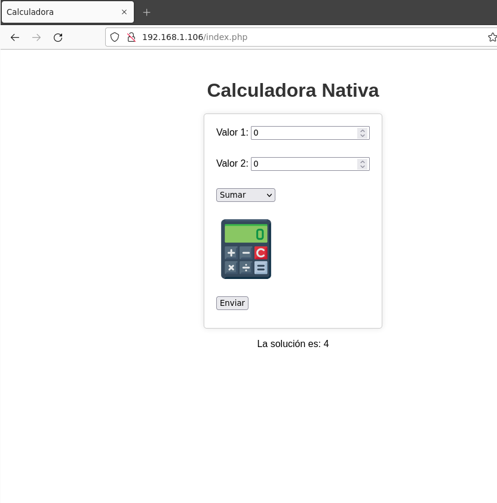

# Tarea Evaluable 1
## Unidad 1
### Aplicación Dockerizada

1. Estructura de la aplicación 
Hemos usado la aplicación relizada según el tutorial de clase.

2. Aplicación Nativa Lanzada 

### Aplicación Nativa

1. Estructura de la aplicación 
En este caso hemos usado la aplicación de ejemplo de Nginx y PHP nativo, simplemente cambiando los parametros y el html. 

 

3. Aplicación Nativa Lanzada 

### Aplicaciones Lanzadas
Aquí podemos ver tanto las versión nativa como la dockerizada lanzadas.

